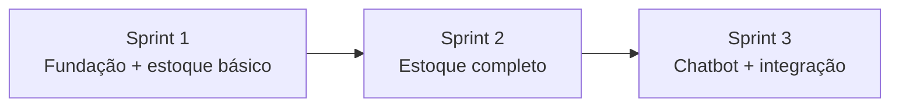

# Sprint Backlog — Zé da Mercearia

Planejamento em **3 sprints**, sem datas fixas. Projeto fictício com pseudocódigo, TDD e Scrumban.

**Referência:** [Product Backlog](../product_backlog/product_backlog_ze_mercearia.md)

---

## Visão geral das sprints

| Sprint | Sprint Goal | Story Points |
|--------|-------------|--------------|
| [Sprint 1](#sprint-1--fundação-e-estoque-básico) | Fundação técnica, mockups, arquitetura, CI/TDD e módulo base de estoque (auth, produtos, lojas) | ~34 SP |
| [Sprint 2](#sprint-2--controle-completo-de-estoque) | Movimentações, alertas, acesso por loja, relatórios e CRUD completo de produtos | ~32 SP |
| [Sprint 3](#sprint-3--chatbot-whatsapp-e-integração) | Chatbot de vendas integrado ao estoque, notificações ao gerente e testes ponta a ponta | ~38 SP |

**Total estimado:** ~104 SP

---

## Definition of Done (global)

- [ ] Pseudocódigo revisado por pelo menos um membro do time
- [ ] Testes unitários escritos antes ou junto da implementação (TDD)
- [ ] Critérios de aceite da user story validados
- [ ] Pipeline CI passando (lint + testes)
- [ ] Mockup ou fluxo documentado quando houver interface
- [ ] Item movido para **Done** no GitHub Projects

---

# Sprint 1 — Fundação e estoque básico

## Sprint Goal

> Estabelecer a base do projeto: arquitetura em camadas, mockups das telas principais, pipeline CI com TDD, autenticação, cadastro/listagem/edição de produtos e registro das cinco mercearias.

## User stories

| ID | User Story | Produto | SP |
|----|-----------|---------|-----|
| — | Como time, quero documentar a arquitetura por responsabilidades, para guiar o pseudocódigo. | Transversal | 3 |
| — | Como time, quero mockups das telas do estoque, para alinhar UX antes da implementação. | Design | 3 |
| — | Como time, quero pipeline CI executando testes unitários, para garantir qualidade contínua (TDD). | Transversal | 3 |
| E4-US01 | Como administrador, quero criar usuários com login e senha, para controlar quem acessa o sistema. | Estoque | 5 |
| E1-US01 | Como gerente, quero cadastrar um produto com nome, descrição, preço e quantidade inicial. | Estoque | 5 |
| E1-US02 | Como gerente, quero editar as informações de um produto cadastrado. | Estoque | 3 |
| E1-US04 | Como gerente, quero listar produtos com filtro por nome ou categoria. | Estoque | 3 |
| E2-US01 | Como gerente, quero registrar cada uma das cinco mercearias no sistema. | Estoque | 3 |
| E2-US02 | Como gerente, quero visualizar o estoque atual de cada produto em cada loja. | Estoque | 5 |

**Subtotal:** ~33 SP

## Tarefas

### Transversal — Arquitetura, mockups e CI

| Task ID | Tarefa | SP |
|---------|--------|-----|
| T-S1-INF-01 | Estruturar pastas (`src/`, `tests/`, `docs/`) e convenções de pseudocódigo | 1 |
| T-S1-INF-02 | Documentar arquitetura em camadas (apresentação, aplicação, domínio, infraestrutura) | 2 |
| T-S1-INF-03 | Criar mockups: login, dashboard, cadastro/listagem de produtos, cadastro de lojas | 3 |
| T-S1-INF-04 | Configurar workflow CI (execução de testes unitários em pseudocódigo) | 2 |
| T-S1-INF-05 | Modelar entidades base (usuário, loja, produto, estoque) em pseudocódigo | 2 |

### E4-US01 — Autenticação

| Task ID | Tarefa | SP |
|---------|--------|-----|
| T-S1-E4-01 | Pseudocódigo: cadastro e persistência de usuário | 1 |
| T-S1-E4-02 | Pseudocódigo: login e controle de sessão/token | 2 |
| T-S1-E4-03 | Testes TDD: auth (sucesso, credenciais inválidas, acesso negado) | 2 |

### E1-US01 / E1-US02 / E1-US04 — Produtos

| Task ID | Tarefa | SP |
|---------|--------|-----|
| T-S1-E1-01 | Pseudocódigo: cadastro de produto com quantidade inicial | 2 |
| T-S1-E1-02 | Pseudocódigo: edição e listagem com filtros | 2 |
| T-S1-E1-03 | Testes TDD: CRUD e validações de campos obrigatórios | 2 |

### E2-US01 / E2-US02 — Lojas e consulta de estoque

| Task ID | Tarefa | SP |
|---------|--------|-----|
| T-S1-E2-01 | Pseudocódigo: CRUD de lojas (cinco unidades) | 2 |
| T-S1-E2-02 | Pseudocódigo: consulta de estoque por loja e por produto | 2 |
| T-S1-E2-03 | Testes TDD: saldo inicial e consulta multi-loja | 2 |

## Incremento esperado

- Arquitetura e mockups publicados
- CI rodando testes unitários
- Gerente autentica, cadastra/edita/lista produtos, registra lojas e consulta estoque

## Fora desta sprint

Saídas de estoque, alertas, chatbot, relatórios exportáveis, notificações WhatsApp ao gerente.

---

# Sprint 2 — Controle completo de estoque

## Sprint Goal

> Completar o módulo de estoque: entradas e saídas por loja, alerta de estoque mínimo, exclusão de produtos, controle de acesso por loja e relatório consolidado.

## User stories

| ID | User Story | Produto | SP |
|----|-----------|---------|-----|
| E2-US03 | Como gerente, quero registrar entradas de estoque (reabastecimento) por loja. | Estoque | 5 |
| E2-US04 | Como gerente, quero registrar saídas de estoque por loja. | Estoque | 5 |
| E2-US05 | Como gerente, quero alerta quando o estoque atingir nível mínimo configurado. | Estoque | 5 |
| E1-US03 | Como gerente, quero excluir um produto do sistema. | Estoque | 3 |
| E4-US02 | Como administrador, quero definir a qual loja cada usuário pertence. | Estoque | 5 |
| E3-US01 | Como gerente, quero relatório consolidado de estoque de todas as lojas. | Estoque | 5 |
| E3-US02 | Como gerente, quero exportar relatório em CSV ou PDF. | Estoque | 3 |

**Subtotal:** ~31 SP

## Tarefas

### E2-US03 / E2-US04 — Movimentações

| Task ID | Tarefa | SP |
|---------|--------|-----|
| T-S2-E2-01 | Pseudocódigo: registro de entrada com log de movimentação | 2 |
| T-S2-E2-02 | Pseudocódigo: registro de saída manual (vendas/perdas) | 2 |
| T-S2-E2-03 | Testes TDD: incremento/decremento de saldo e quantidade inválida | 3 |

### E2-US05 — Alertas

| Task ID | Tarefa | SP |
|---------|--------|-----|
| T-S2-E2-04 | Pseudocódigo: configuração de estoque mínimo por produto/loja | 2 |
| T-S2-E2-05 | Pseudocódigo: disparo de alerta ao cruzar limite | 2 |
| T-S2-E2-06 | Testes TDD: alerta dispara e não dispara conforme saldo | 2 |

### E1-US03 / E4-US02 — Exclusão e permissões

| Task ID | Tarefa | SP |
|---------|--------|-----|
| T-S2-E1-01 | Pseudocódigo: exclusão lógica/física de produto | 2 |
| T-S2-E4-01 | Pseudocódigo: vínculo usuário ↔ loja e filtro de acesso | 2 |
| T-S2-E4-02 | Testes TDD: usuário só acessa estoque da sua loja | 2 |

### E3-US01 / E3-US02 — Relatórios

| Task ID | Tarefa | SP |
|---------|--------|-----|
| T-S2-E3-01 | Pseudocódigo: relatório consolidado multi-loja | 2 |
| T-S2-E3-02 | Pseudocódigo: exportação CSV/PDF | 2 |
| T-S2-E3-03 | Testes TDD: totais e formato de exportação | 2 |

## Incremento esperado

- Estoque com entradas, saídas e alertas operacionais
- Permissão por loja funcional
- Relatório consolidado exportável

## Dependências

Sprint 1 concluída (entidades, auth, lojas e consulta de estoque).

---

# Sprint 3 — Chatbot WhatsApp e integração

## Sprint Goal

> Entregar o chatbot de vendas pelo WhatsApp integrado ao estoque: consulta, pedidos com confirmação, baixa automática, sugestão em falta e notificação ao gerente — com testes de integração em pseudocódigo.

## User stories

| ID | User Story | Produto | SP |
|----|-----------|---------|-----|
| E1-US01 | Como cliente, quero perguntar sobre um produto e receber nome, preço e disponibilidade. | Chatbot | 5 |
| E1-US02 | Como cliente, quero listar produtos disponíveis por categoria. | Chatbot | 3 |
| E2-US01 | Como cliente, quero montar um pedido informando produto e quantidade. | Chatbot | 5 |
| E2-US02 | Como cliente, quero receber resumo do pedido antes de confirmar. | Chatbot | 3 |
| E2-US03 | Como cliente, quero confirmar ou cancelar meu pedido pelo chat. | Chatbot | 5 |
| E3-US01 | Como sistema, quero consultar estoque em tempo real ao receber pedido. | Chatbot | 5 |
| E3-US02 | Como sistema, quero baixar estoque ao confirmar pedido. | Chatbot | 5 |
| E3-US03 | Como sistema, quero informar falta e sugerir alternativas. | Chatbot | 3 |
| E4-US01 | Como gerente, quero notificação no WhatsApp a cada pedido confirmado. | Chatbot | 5 |
| E4-US02 | Como gerente, quero resumo do pedido com nome e telefone do cliente. | Chatbot | 3 |

**Subtotal:** ~42 SP

## Tarefas

### Integração WhatsApp e consulta

| Task ID | Tarefa | SP |
|---------|--------|-----|
| T-S3-C0-01 | Documentar integração Estoque ↔ Chatbot (webhook, API interna) | 2 |
| T-S3-C1-01 | Pseudocódigo: webhook WhatsApp (receber/enviar mensagens) | 2 |
| T-S3-C1-02 | Pseudocódigo: consulta de produto e listagem por categoria | 2 |
| T-S3-C1-03 | Testes TDD: respostas de consulta (encontrado, não encontrado, sem estoque) | 2 |

### Fluxo de pedido

| Task ID | Tarefa | SP |
|---------|--------|-----|
| T-S3-C2-01 | Pseudocódigo: máquina de estados (montagem → resumo → confirmação) | 3 |
| T-S3-C2-02 | Pseudocódigo: confirmação e cancelamento | 2 |
| T-S3-C2-03 | Testes TDD: happy path e cancelamento sem baixa | 2 |

### Integração com estoque

| Task ID | Tarefa | SP |
|---------|--------|-----|
| T-S3-C3-01 | Pseudocódigo: validação de disponibilidade em tempo real | 2 |
| T-S3-C3-02 | Pseudocódigo: baixa automática transacional na confirmação | 2 |
| T-S3-C3-03 | Pseudocódigo: mensagem de falta com alternativas | 2 |
| T-S3-C3-04 | Testes TDD: estoque insuficiente e concorrência básica | 3 |

### Notificações ao gerente

| Task ID | Tarefa | SP |
|---------|--------|-----|
| T-S3-C4-01 | Pseudocódigo: notificação WhatsApp ao gerente (novo pedido) | 2 |
| T-S3-C4-02 | Pseudocódigo: resumo com dados do cliente | 1 |
| T-S3-C4-03 | Testes TDD: notificação disparada apenas após confirmação | 2 |

### Encerramento

| Task ID | Tarefa | SP |
|---------|--------|-----|
| T-S3-E2E-01 | Testes de integração pseudocódigo: fluxo completo estoque → chat → baixa | 3 |
| T-S3-E2E-02 | Atualizar documentação final e incremento do produto | 2 |

## Incremento esperado

- Cliente compra pelo WhatsApp com validação de estoque
- Pedido confirmado baixa estoque e notifica gerente
- Produto completo demonstrável como simulação Scrumban + TDD

## Dependências

Sprints 1 e 2 concluídas (API de estoque, movimentações e permissões).

---

## Fluxo entre sprints

---

## Kanban (GitHub Projects)

Colunas sugeridas para Scrumban:

| Coluna | Uso |
|--------|-----|
| **Backlog** | User stories ainda não puxadas |
| **Ready** | Refinadas e prontas para desenvolvimento |
| **In Progress** | Em desenvolvimento (WIP limitado) |
| **Review** | Code review / revisão de pseudocódigo |
| **Testing** | TDD / CI |
| **Done** | DoD atendida |

Cards vinculados às user stories (`E1-US01`, etc.) e tasks (`T-S1-INF-01`, etc.).

---

## Riscos (projeto)

| Risco | Mitigação |
|-------|-----------|
| Escopo grande para 3 sprints | Priorizar DoD mínima; E3-US02 (export PDF) pode ser simplificada para CSV |
| Pseudocódigo divergir da arquitetura | Sprint 1 fixa arquitetura antes do restante |
| Integração chat ↔ estoque complexa | Documento de integração (T-S3-C0-01) no início da Sprint 3 |

---

*Sprint backlog derivado do [Product Backlog](../product_backlog/product_backlog_ze_mercearia.md). Três sprints, sem datas — alinhado ao escopo fictício Scrumban + TDD + pseudocódigo.*
